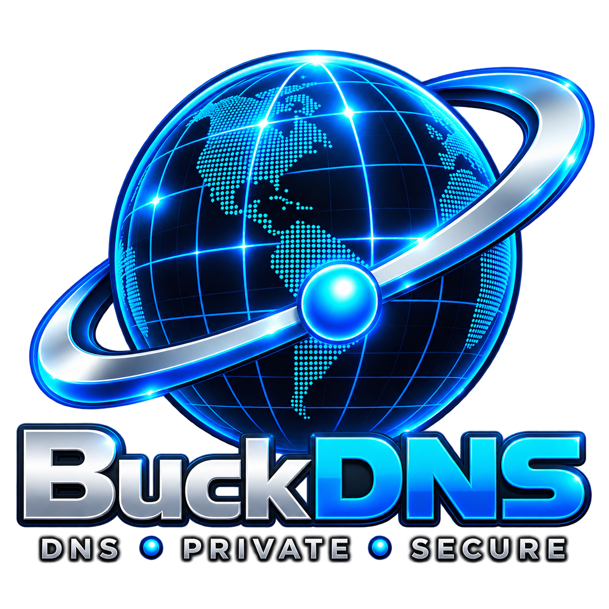
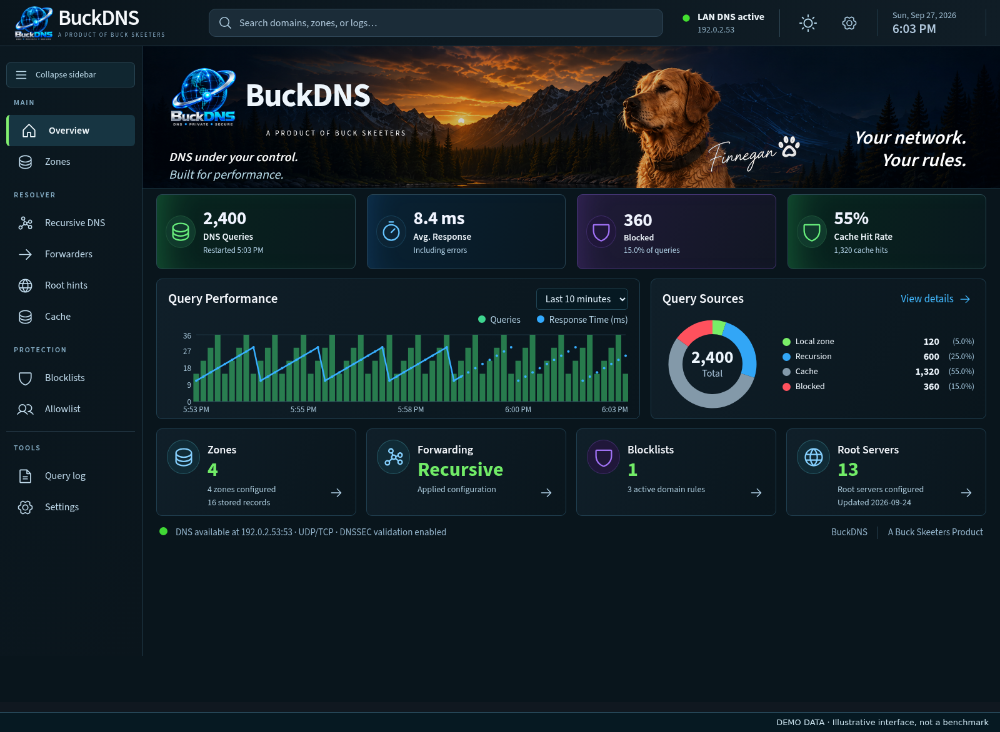

# BuckDNS

**Your network. Your rules. Free.**

A fully recursive DNS server with network-wide ad and tracker blocking, local zones, and primary/replica clustering. Built by Buck Skeeters, LLC for Linux and Windows, on compatible physical machines or virtual machines.

**Free for personal and business use. Proprietary software. Source code is not publicly available.**

[Download and setup](https://buckskeeters.com/apps/buckdns/download/) · [Website](https://buckskeeters.com/apps/buckdns/) · [Screenshots](https://buckskeeters.com/apps/buckdns/#screenshots) · [Optional donations](https://buymeacoffee.com/buckdns)

## Features

- **Native DNS engine:** full recursive resolution from root hints, QNAME minimization, and DNSSEC validation.
- **Network-wide filtering:** subscription blocklists and allowlists, scheduled refreshes, custom blocked domains and exceptions.
- **Flexible forwarding:** DNS-over-HTTPS, DNS-over-TLS, UDP and TCP upstreams, parallel queries, and conditional routing.
- **Local domains:** authoritative zones and DNS record management, DNSSEC signing and automatic signature renewal.
- **Cache controls:** memory and TTL limits, prefetch, persistence across restarts, and Flush cache.
- **Clustering:** authenticated TLS configuration synchronization between a primary and replicas. Replicas continue with their last accepted configuration if disconnected.
- **Browser administration:** dashboard, query logs, filtering controls and diagnostics.

## See BuckDNS

Screenshots contain illustrative demo data, not performance benchmarks. The [website carousel](https://buckskeeters.com/apps/buckdns/#screenshots) previews the latest interface; some screens include changes coming in the next packaged release.

## Install

1. Open the [downloads and setup page](https://buckskeeters.com/apps/buckdns/download/).
2. Choose the Linux or Windows package and follow its numbered installation steps. Linux requires a compatible Debian-based system with Node.js 20 or newer and systemd. The Windows x64 package includes its runtime.
3. Open the web console, review and accept the Terms and Privacy Notice, then configure DNS and filtering for your network.
4. Configure the intended devices or your router’s DHCP settings to use your BuckDNS server for DNS.

Keep the administration console accessible only to trusted users on your internal network. DNS filtering applies to devices using BuckDNS and cannot remove every advertisement. Encrypted DNS support covers upstream forwarding. Clustering synchronizes configuration; automatic primary promotion is not included.

## Updates and privacy

Setup requires acceptance of the [Terms](TERMS.txt) and [Privacy Notice](PRIVACY.txt). Required daily check-ins provide update notifications and installation statistics using a random installation ID, application version, operating system and installation date. DNS queries, browsing history and local network configuration are not collected by the reporting service. After acceptance, check-in failures do not interrupt DNS. Updates require administrator action.

## Support and feedback

Use this repository’s Issues tab for bug reports and feature requests. Include your BuckDNS version, operating system, steps to reproduce the issue and the expected result. Remove credentials, tokens, private network details and personal information from attachments.

For support or a sensitive security report, email [support@buckskeeters.com](mailto:support@buckskeeters.com).

## License and donations

BuckDNS is free proprietary software, not open source. See the [Terms of Use](TERMS.txt). This repository contains public documentation and support materials; it does not publish the application source code.

Donations are entirely optional: [Buy Me a Coffee](https://buymeacoffee.com/buckdns).

© 2026 Buck Skeeters, LLC. All rights reserved.
